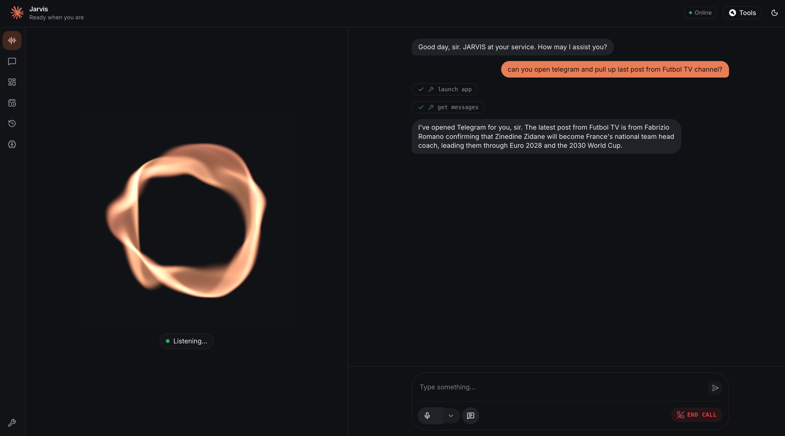
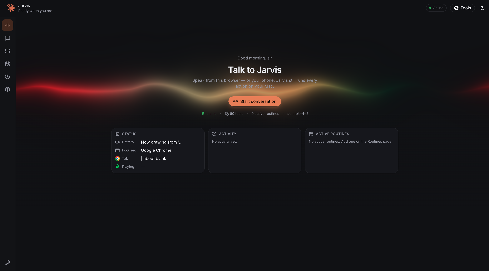
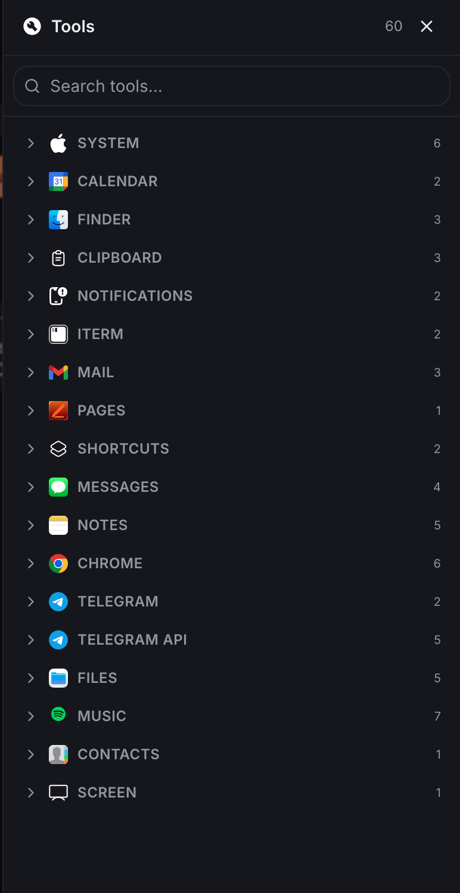

# Jarvis — Personal Mac Assistant

A voice-and-text AI assistant that controls your Mac. Claude is the brain, an
AppleScript-powered [MCP](https://modelcontextprotocol.io) server is the hands,
and a React HUD-style web UI is the face.

Say (or type) *"open YouTube and find the latest Claude videos"*, *"what's my
battery level?"*, or *"send Ali a Telegram message that I'm running late"* —
Jarvis plans the steps, calls the right macOS tools, and reports back, with a
confirmation gate before anything irreversible happens.



*Talk to Jarvis by voice from the browser (or your phone) — the transcript
streams both sides and every Mac tool call appears live as it runs.*

## Repository Layout

```
jarvis/
├── applescript-mcp/        # MCP server + Jarvis backend
│   ├── src/                #   MCP server: 60 tools across 18 macOS categories
│   │   ├── categories/     #   calendar, chrome, clipboard, contacts, files,
│   │   │                   #   finder, iterm, mail, messages, music, notes,
│   │   │                   #   notifications, pages, screen, shortcuts,
│   │   │                   #   system, telegram, telegramApi
│   │   ├── framework.ts    #   AppleScript execution framework
│   │   └── index.ts        #   MCP server entry point
│   └── jarvis/             #   The assistant itself
│       ├── server.mjs      #   HTTP + WebSocket backend (the always-on brain)
│       ├── client.mjs      #   thin terminal text client
│       ├── voice.mjs       #   push-to-talk voice client (local Whisper)
│       ├── voice-wake.mjs  #   always-listening "Jarvis" wake word (Picovoice)
│       ├── brain.mjs       #   standalone CLI / REPL, no server needed
│       └── src/            #   agent loop, MCP client, providers, TTS, memory,
│                           #   scheduler, config
├── livekit-agent/          # LiveKit voice agent (Python) — browser/phone voice
│   ├── agent.py            #   session wiring: Whisper STT + Claude + ElevenLabs
│   ├── whisper_stt.py      #   custom STT over the local whisper-server
│   ├── jarvis_tools.py     #   memory/activity/routine tools via backend REST
│   ├── tool_events.py      #   streams live tool activity to the browser
│   └── tests/              #   behavioral pytest suite
└── client/                 # Web UI — React 19 + Vite + Tailwind v4
    └── src/                #   Iron-Man-style HUD: voice, chat, dashboard,
                            #   routines, activity, memory, tool palette
```

## Architecture

A long-running **backend** holds the MCP connection and the agent loop; thin
**clients** (terminal, voice, web UI) talk to it over HTTP/WebSocket.

```
clients                      backend (server.mjs)                  tools
────────                     ─────────────────────                 ─────
client.mjs   ─┐              ┌── src/agent.mjs ──┐
voice.mjs    ─┼─ HTTP/WS ──▶ │   src/providers/  │ ──▶ MCP client ──▶ applescript-mcp ──▶ macOS
web UI       ─┘              └── src/mcp.mjs ────┘        (Claude)
```

Key design points:

- **Provider-agnostic agent loop** — Claude today; add OpenAI/Ollama by writing
  one file in `jarvis/src/providers/` and registering it in
  `providers/index.mjs`.
- **Capabilities live in the MCP server** — adding a tool requires zero brain
  changes.
- **Streaming over WebSocket** — clients receive `step` events as tools run,
  `confirm` requests for gated tools, then the `final` reply.

## Features

### macOS control (60 MCP tools)

| Category | Examples |
| --- | --- |
| System | volume, dark mode, battery, launch/quit apps |
| Chrome | open URLs, search, read/control tabs |
| Calendar & Reminders | create events, list today's schedule |
| Mail & Messages | compose email, list/search/send messages |
| Telegram | send/read messages (bot API + user account via MTProto) |
| Notes & Pages | create formatted notes, documents |
| Files & Finder | search, move, reveal files |
| Music | playback control |
| Clipboard | get/set/clear |
| Shortcuts | run any macOS Shortcut |
| Screen, iTerm, Contacts, Notifications | screenshots, terminal commands, lookups, alerts |

### Voice

- **Push-to-talk** (`voice.mjs`) — record with SoX, transcribe locally with
  whisper.cpp (no audio leaves your machine).
- **Conversational wake word** (`voice-wake.mjs`) — always-listening "Jarvis"
  trigger, with a ChatGPT-voice-style loop: an acknowledgment chime the instant
  it hears you, speech that starts while the model is still writing, barge-in
  ("Jarvis" interrupts it mid-sentence or mid-thought), and a follow-up window
  after each reply so you can keep talking without repeating the wake word.
- **Low-latency pipeline** — a persistent `whisper-server` keeps the STT model
  in RAM (~0.3s per transcription instead of a 1–3s cold start), end-of-speech
  is detected after ~0.45s of silence (`JARVIS_SILENCE_MS`), and Claude's
  tokens stream straight into the ElevenLabs WebSocket, whose PCM audio pipes
  to the speaker as it arrives — roughly 1–1.5s from when you stop talking to
  when Jarvis starts answering.
- **Natural speech replies** — ElevenLabs neural TTS when a key is present
  (low-latency `eleven_flash_v2_5` streamed over WebSocket by default),
  automatic fallback to per-sentence HTTP synthesis or the macOS `say` voice.
- **LiveKit voice agent** (`livekit-agent/`) — a Python worker on the LiveKit
  Agents framework with professional turn detection and barge-in. Same local
  Whisper STT, same ElevenLabs voice, all Mac tools via MCP, and memory shared
  with the backend over REST. `agent.py console` runs fully local; with LiveKit
  Cloud credentials you can talk to Jarvis from your phone or browser anywhere
  while actions execute on your Mac.

### Memory

- **Conversations survive restarts** — voice clients share a stable session
  (`JARVIS_SESSION`, default `voice`), so "continue where we left off" just
  works; histories are trimmed to the last ~40 messages automatically.
- **Activity recall** — every turn is logged to `~/.jarvis/log/`, the last few
  interactions are injected into each turn for ambient continuity, and an
  `activity_recall` tool lets Jarvis answer "what did we do yesterday?" by
  actually reading its diary (up to 14 days back).
- **Long-term facts** — Jarvis saves durable facts it learns in passing
  (names, preferences, projects) via `memory_save` and consults them before
  asking things it should already know. "Remember/forget…" still works
  explicitly.

### Web UI

Iron-Man-inspired dashboard app built with React 19, Vite, Tailwind CSS v4,
and shadcn/ui-style components. A sidebar navigates six pages (hash-routed,
so the chat WebSocket and an in-flight voice call survive page switches):

- **Voice** *(default landing)* — the home screen: a WebGL aurora glows behind
  the greeting and **Start conversation** button, with live ambient cards
  (Mac status, recent activity, active routines) below. Start a call and it
  becomes a full-duplex conversation with the LiveKit agent — an audio-reactive
  core, a streaming transcript of both sides, the agent's state
  (listening / thinking / speaking), and each Mac tool call shown live as it
  runs. Works from the browser or your phone. Needs `LIVEKIT_*` credentials
  plus the agent running (`python agent.py dev`); until then the page explains
  the setup rather than failing.
- **Chat** — streamed text conversation with inline confirmation prompts and
  browser speech recognition for voice input.
- **Dashboard** — mission control: backend health, model, tool/session/routine
  stats, today's interaction count with most-used tools, live Mac status
  (battery, focused app, tab, now playing), quick actions.
- **Routines** — full scheduler with a friendly builder (every day / weekdays /
  weekly at a time → cron generated for you), enable/disable switches.
- **Activity** — Jarvis's diary, browsable by day with search.
- **Memory** — view, search, teach, and delete long-term facts
  (`GET/POST/DELETE /memory` on the backend).



*The Voice home screen — a cinematic landing that's also live: status, recent
activity, and routines at a glance, one click from talking.*

Plus a tool palette listing every connected capability, grouped by app:



### Safety gate

Irreversible or outbound tools are **held for confirmation** before running
(default: sending Telegram messages, composing mail, quitting apps — see
`JARVIS_CONFIRM_TOOLS`). Over REST they are denied unless `autoConfirm: true`;
over WebSocket the server asks the connected client interactively. Content
read from web pages, messages, and emails is treated as untrusted data, and the
agent loop is bounded by `JARVIS_MAX_STEPS` and per-tool timeouts.

## Getting Started

### Prerequisites

- macOS 10.15+ (AppleScript automation requires macOS)
- Node.js 18+
- An [Anthropic API key](https://console.anthropic.com/)

### 1. Install & build the backend

```bash
cd applescript-mcp
npm install && npm run build
```

### 2. Configure

```bash
cp .env.example .env
# then edit .env — at minimum set:
#   ANTHROPIC_API_KEY=sk-ant-...
#   JARVIS_MODEL=claude-sonnet-4-5   (any model your account supports)
```

### 3. Run the backend

```bash
node jarvis/server.mjs
```

Verify it's up:

```bash
curl -s localhost:8787/health
curl -s localhost:8787/tools
```

### 4. Pick a client

**Terminal (text):**

```bash
node jarvis/client.mjs
```

**Voice (push-to-talk):**

```bash
brew install sox whisper-cpp
curl -L -o ~/ggml-base.en.bin \
  https://huggingface.co/ggerganov/whisper.cpp/resolve/main/ggml-base.en.bin
node jarvis/voice.mjs        # Enter to talk, Enter to stop
```

**Wake word (always listening):** the default engine is
[openWakeWord](https://github.com/dscripka/openWakeWord) — free, offline, no
account. One-time setup:

```bash
python3 -m venv jarvis/wakeword/.venv
jarvis/wakeword/.venv/bin/pip install openwakeword onnxruntime
jarvis/wakeword/.venv/bin/python -c \
  "from openwakeword.utils import download_models; download_models(model_names=['hey_jarvis_v0.1'])"
node jarvis/voice-wake.mjs   # say "Hey Jarvis" to activate
```

(Alternative: set `PICOVOICE_ACCESS_KEY` from
[console.picovoice.ai](https://console.picovoice.ai) to use Porcupine instead —
wake phrase is just "Jarvis".)

Once it answers, just keep talking — the mic stays hot for a few seconds
(`JARVIS_FOLLOWUP_MS`). Say "Jarvis" at any time to interrupt it.

**Web UI:**

```bash
cd ../client
npm install
npm run dev                  # opens on http://localhost:5173
```

The UI connects to `ws://localhost:8787` by default; override with
`VITE_JARVIS_URL` in `client/.env`.

**Standalone (no server):**

```bash
node jarvis/brain.mjs "what's my battery level?"
node jarvis/brain.mjs        # interactive REPL
```

### One-time extras

- **Telegram user-account tools** need a one-time login:
  `node telegram-login.mjs` (session is stored in the gitignored
  `telegram-auth.json`).
- **macOS permissions** — the first time a tool touches an app, macOS will ask
  for Automation/Accessibility permission; grant it in
  System Settings → Privacy & Security.

## HTTP / WebSocket API

| Endpoint | Description |
| --- | --- |
| `GET /health` | `{ ok, provider, model, tools, sessions, routines, livekit }` |
| `GET /tools` | `[{ name, description }]` |
| `POST /chat` | body `{ text, sessionId?, autoConfirm?, speak? }` → `{ reply, steps, sessionId }` |
| `GET /log?day=` | activity log for a day (Jarvis's diary) |
| `GET/POST/DELETE /memory` | list / add / delete long-term facts |
| `GET/POST/DELETE /routines` | manage scheduled routines |
| `POST /livekit/token` | mint a short-lived room token for the browser Voice page |
| WebSocket | send `{type:"chat", text, sessionId?}`; receive `step`, `confirm`, `final`, `error`; answer a `confirm` with `{type:"confirm", id, allow}` |

Example:

```bash
curl -s localhost:8787/chat -H 'content-type: application/json' \
  -d '{"text":"open youtube and find the latest claude videos","autoConfirm":true}'
```

## Configuration Reference

All settings live in `applescript-mcp/.env` (see
[`.env.example`](applescript-mcp/.env.example) for the full annotated list).

| Env | Purpose | Default |
| --- | --- | --- |
| `ANTHROPIC_API_KEY` | Claude access (required) | — |
| `JARVIS_MODEL` | Claude model id | `claude-sonnet-4-5` |
| `JARVIS_PROVIDER` | LLM provider | `anthropic` |
| `JARVIS_PORT` | backend port | `8787` |
| `JARVIS_MAX_TOKENS` | reply length cap | `1024` |
| `JARVIS_CONFIRM_TOOLS` | comma list of confirmation-gated tools | telegram/mail/quit |
| `JARVIS_MAX_STEPS` | agent loop step limit | `15` |
| `JARVIS_TOOL_TIMEOUT_MS` | per-tool timeout | `30000` |
| `JARVIS_SILENT` | `1` disables spoken replies | off |
| `ELEVENLABS_API_KEY` / `ELEVENLABS_VOICE_ID` | neural TTS | fallback to `say` |
| `JARVIS_VOICE` | macOS fallback voice | `Daniel` |
| `WHISPER_BIN` / `WHISPER_MODEL` / `REC_BIN` | local voice input | `whisper-cli` / `~/ggml-base.en.bin` / `sox` |
| `JARVIS_WAKE_ENGINE` | `openwakeword` or `porcupine` | auto |
| `JARVIS_WAKE_THRESHOLD` | openWakeWord sensitivity (0..1) | `0.5` |
| `JARVIS_MIC` | pin the microphone by name substring | system default |
| `JARVIS_WAKE_DEBUG` | `1` prints live wake scores + mic level | off |
| `PICOVOICE_ACCESS_KEY` | enables the Porcupine engine | — |
| `JARVIS_FOLLOWUP_MS` | follow-up listening window after a reply | `7000` |
| `JARVIS_WAKE_SOUND` | wake acknowledgment chime file | `Pop.aiff` |
| `JARVIS_ONSET_RMS` | speech-onset threshold in the follow-up window | `700` |
| `JARVIS_SILENCE_MS` | trailing silence that ends an utterance | `450` |
| `LIVEKIT_URL` / `LIVEKIT_API_KEY` / `LIVEKIT_API_SECRET` | LiveKit Cloud (browser/phone voice) | — |
| `VITE_JARVIS_URL` (client) | backend WebSocket URL | `ws://localhost:8787` |

## Tech Stack

- **Backend** — Node.js (ESM), Express 5, `ws`, `@anthropic-ai/sdk`,
  `@modelcontextprotocol/sdk`, node-cron, GramJS (`telegram`)
- **MCP server** — TypeScript, AppleScript via `osascript`
- **Voice** — whisper.cpp + SoX (input), openWakeWord / Picovoice Porcupine
  (wake word), ElevenLabs / macOS `say` (output)
- **LiveKit agent** — Python, LiveKit Agents SDK, Silero VAD, local whisper-server
  STT, ElevenLabs TTS, Anthropic LLM
- **Web UI** — React 19, TypeScript, Vite, Tailwind CSS v4, shadcn/ui-style
  components, `@livekit/components-react`, ogl (aurora shader), lucide-react

## Development

```bash
# MCP server + backend
cd applescript-mcp
npm run build          # compile TypeScript
npm test               # build + node --test
node smoke.mjs         # smoke-test the MCP server
node try-tool.mjs      # invoke a single tool by hand

# Web UI
cd client
npm run dev            # dev server with HMR
npm run typecheck      # tsc --noEmit
npm run lint           # eslint
npm run build          # production build
```

## Security Notes

- `.env`, `telegram-auth.json`, and local runtime data (`.jarvis/`) are
  gitignored — never commit them.
- Everything the agent reads from external sources (web pages, emails,
  messages) is treated as untrusted input, and outbound actions sit behind the
  confirmation gate.
- Voice transcription runs fully locally; only the conversation text goes to
  the LLM provider.

## Acknowledgements

The MCP server builds on
[joshrutkowski/applescript-mcp](https://github.com/joshrutkowski/applescript-mcp)
(MIT), extended here with Chrome, Telegram, Contacts, Files, Music, Screen,
and Messages tooling plus the Jarvis agent backend.

## License

MIT — see [LICENSE](applescript-mcp/LICENSE).
